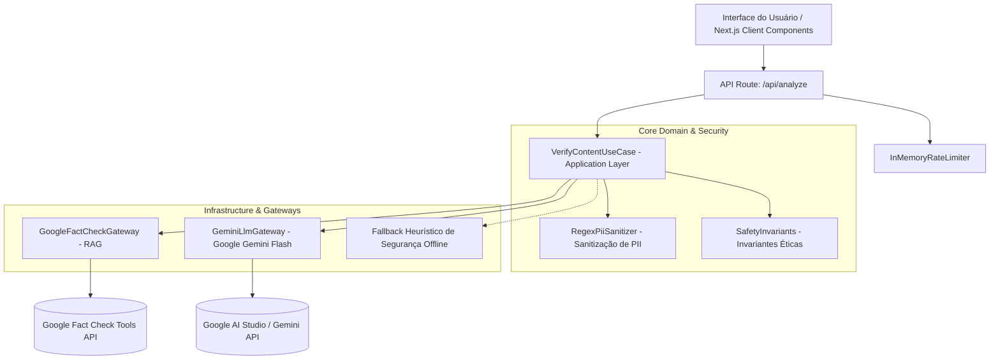

# Confere Aí — Assistente Inteligente Contra Golpes e Desinformação
## FIAP Tech4Change 2026 | "Potencializando o Ser Humano com Inteligência Artificial"

[](tests/)
[](docs/specs/sdd_mvp_confere_ai.md)
[](tsconfig.json)
[](docs/deployment/google_cloud_run.md)

> *"Antes de acreditar, clicar ou pagar: confira."*

---

## 1. Descrição da Solução

O **Confere Aí** é um WebApp mobile-first projetado para orientar pessoas — especialmente idosos, cidadãos com menor familiaridade digital e microempreendedores — a identificar táticas de engenharia social, mensagens falsas de WhatsApp/SMS e cobranças/boletos fraudulentos antes de tomarem decisões financeiras precipitadas.

### Princípios Inegociáveis do Projeto:
* **Amplificação Cognitiva sem Falsa Certeza:** O sistema **nunca** rotula mensagens como "100% seguro" ou "garantido". Todo o veredito é probabilístico (`BAIXO_RISCO`, `SUSPEITO`, `ALTO_RISCO`, `INCONCLUSIVO`), fortalecendo a atenção crítica e a autonomia do usuário.
* **Privacy-by-Design (LGPD):** Sanitização e mascaramento automático de CPFs, telefones, e-mails e chaves Pix **antes** que qualquer texto chegue aos provedores de Inteligência Artificial.
* **Transparência Pedagógica:** Resumo conciso de 2 linhas legível em 5 segundos, com acordeão expansível para inspeção de indicadores técnicos, fontes jornalísticas e um checklist prático ("O que fazer agora").
* **Acessibilidade Inclusiva:** Entrada multimodal por digitação, anexo de imagens e **gravação por voz em tempo real via microfone com transcrição em Português (`pt-BR`)**.

---

## 2. Tecnologias, Linguagens e Frameworks Utilizados

* **Linguagem Principal:** TypeScript (v5.x) configurado com `strict: true`.
* **Framework Fullstack:** Next.js 14 (App Router, Server Actions e API Routes).
* **Interface & Estilização:** React 18, Tailwind CSS, Lucide React (Ícones vetoriais) e Web Speech API nativa.
* **Design System & Acessibilidade:** Conformidade com WCAG 2.1 AA (touch targets ≥ 48px, contraste de texto rigoroso, tipografia base em 16px).
* **Qualidade & Testes:** Vitest + React Testing Library (TDD com 27 testes automatizados cobrindo domínio, casos de uso, componentes e rotas).
* **Conteinerização & Nuvem:** Docker multi-stage build implantado no **Google Cloud Run** com auto-scaling serverless.

---

## 3. Arquitetura Geral do Sistema

O sistema foi concebido sob os princípios da **Clean Architecture** e do **SOLID**, garantindo total desacoplamento entre regras de negócio centrais e frameworks ou APIs de terceiros.



### Fluxo de Processamento em 3 Camadas:
1. **Borda & Segurança:** Rate limiter in-memory contra abuso e validação de schema via Zod;
2. **Higienização de Privacidade:** Redação antecipada de dados pessoais com contagem de itens mascarados;
3. **Orquestração RAG & IA:** Checagem cruzada com bases factuais, injeção em prompt blindado com isolamento XML `<user_input_to_verify>` e saída estrita via JSON Schema.

---

## 4. APIs, Modelos de Inteligência Artificial e Bases de Dados

| Componente | Tecnologia Utilizada | Finalidade no Sistema |
| :--- | :--- | :--- |
| **Modelo de Raciocínio (LLM)** | **Google Gemini 1.5 / 2.0 Flash** via `@google/genai` | Avaliação de tom de urgência, coerência cadastral, táticas de engenharia social e geração de veredito empático estruturado via JSON Schema. |
| **Base de Checagem Factual (RAG)** | **Google Fact Check Tools API** | Consulta em tempo real a mais de 200 mil checagens jornalísticas de agências certificadas (Lupa, Aos Fatos, AFP, E-Farsas). |
| **Sanitizador de PII** | Motor Heurístico Regex Local | Detecção e substituição determinística de CPFs (`***.***.***-**`), telefones, chaves Pix e endereços de e-mail antes do LLM. |
| **Proteção contra Abuso** | `InMemoryRateLimiter` | Controle de vazão baseado em IP (15 req/min) para garantir estabilidade e proteção contra custos descontrolados. |
| **Transparência de Voz** | Web Speech API (`SpeechRecognition`) | Transcrição contínua de áudio do microfone do usuário diretamente no navegador em Português (`pt-BR`). |

---

## 5. Instruções para Instalação e Execução

### Pré-requisitos
* Node.js 18.17 ou superior;
* Chave de API do Gemini (`GEMINI_API_KEY`) obtida gratuitamente no [Google AI Studio](https://aistudio.google.com/).

### Execução Local

1. **Clonar o repositório:**
   ```bash
   git clone https://github.com/Emerson21/confere-ai.git
   cd confere-ai
   ```

2. **Instalar as dependências:**
   ```bash
   npm install
   ```

3. **Configurar as variáveis de ambiente:**
   Crie um arquivo `.env.local` na raiz com:
   ```env
   GEMINI_API_KEY=sua_chave_do_gemini_aqui
   NODE_ENV=development
   # Opcional:
   FACT_CHECK_API_KEY=sua_chave_do_google_fact_check
   ```

4. **Executar em modo de desenvolvimento:**
   ```bash
   npm run dev
   ```
   Acesse a aplicação em [http://localhost:3000](http://localhost:3000).

5. **Executar os testes automatizados:**
   ```bash
   npm test
   ```

### Execução via Docker

```bash
# Construir a imagem do contêiner
docker build -t confere-ai .

# Executar o contêiner mapeando a porta 3000
docker run -p 3000:3000 -e GEMINI_API_KEY="sua_chave" confere-ai
```

---

## 6. Integrantes da Equipe e Suas Respectivas Contribuições

| Integrante | RM | Papel / Responsabilidades | Principais Contribuições |
| :--- | :--- | :--- | :--- |
| **Mônica Mazzochi Hillman** | RM 375183 | Head de Produto | Concepção e aplicação da pesquisa de validação (39 respondentes), síntese de aprendizados e modelagem Pay-per-Query. |
| **Emerson da Silva Alonso Haraguchi** | RM 376499 | Head of AI Engineering | Engenharia de prompts, integração com Gemini API, definição de invariantes éticas de IA e RAG. |
| **Daniel Britto da Graça** | RM 370691 | Frontend & DevOps Engineer | Telas responsivas em Next.js/Tailwind, Web Speech API nativa para áudio, conteinerização Docker e deploy no Cloud Run. |

---

## 7. Limitações Conhecidas e Próximos Passos

### Limitações Conhecidas no MVP Atual:
1. **Reconhecimento de Voz Dependente de Navegador:** A transcrição por voz utiliza a Web Speech API, amplamente suportada no Google Chrome, Edge, Safari e Android, mas dependente de permissões do navegador em sistemas com microfone desabilitado.
2. **OCR Visual Preliminar em Imagens:** O processamento atual aceita anexos e imagens no fluxo de envio, mas a extração aprofundada de código de barras em arquivos PDF escaneados ainda opera em versão inicial.

### Próximos Passos no Roadmap de Evolução:
1. **Bot Verificado no WhatsApp e Telegram:** Canal conversacional onde o usuário pode simplesmente encaminhar um áudio ou mensagem suspeita para receber a resposta imediata.
2. **OCR Especializado em Boletos:** Validação cruzada automática dos dígitos do código de barras e do CNPJ do beneficiário com a base da Receita Federal.
3. **Fine-Tuning de Modelo SLM com Bases Nacionais:** Treinamento especializado de um modelo aberto (Gemma 2 / Llama 3 8B) utilizando bases históricas de denúncias do Procon e CERT.br, aumentando a precisão em gírias regionais brasileiras.
4. **Módulo de Proteção Familiar ("Confere Aí Família"):** Painel para que filhos recebam notificações quando parentes idosos checarem golpes de alta gravidade.

---

## 📂 Central de Documentos da Entrega (FIAP Tech4Change)

* **[Documento Central de Entrega para PDF](docs/entrega/Tech4Change_Documento_Central.md)**
* **[Pitch Deck Completo (11 Slides)](docs/pitch/pitch_deck_tech4change.md)**
* **[Roteiro do Vídeo de Pitch (5 Minutos)](docs/pitch/video_pitch_script_5min.md)**
* **[Guia de Testes do MVP para a Banca](docs/specs/guia_testes_mvp_banca.md)**
* **[Relatório de Validação e Aprendizados (39 Respondentes)](docs/research/relatorio_validacao_aprendizados.md)**
* **[Matriz de Alinhamento com a Banca](docs/specs/matriz_criterios_banca.md)**
* **[Guia de Deploy no Google Cloud Run](docs/deployment/google_cloud_run.md)**
